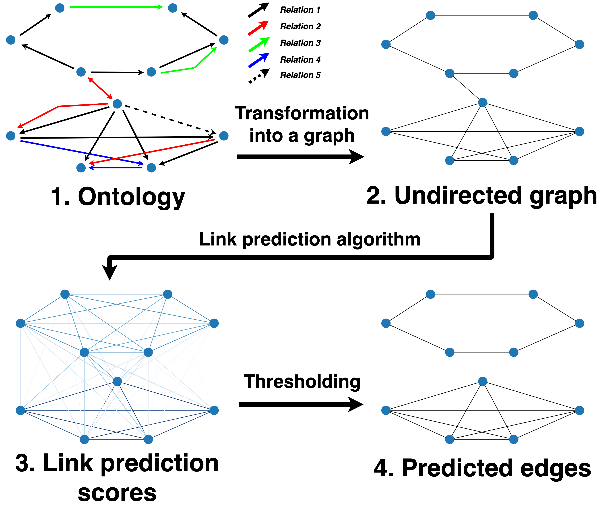
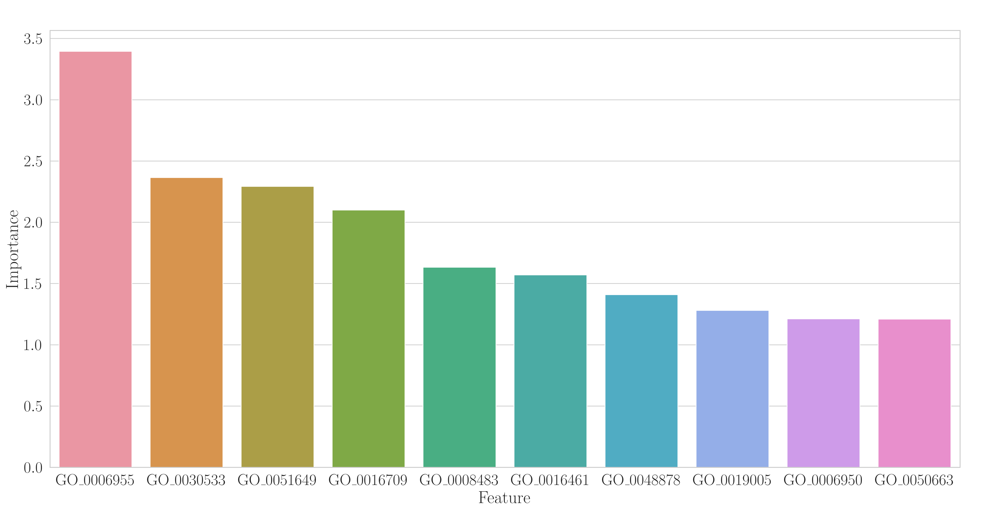
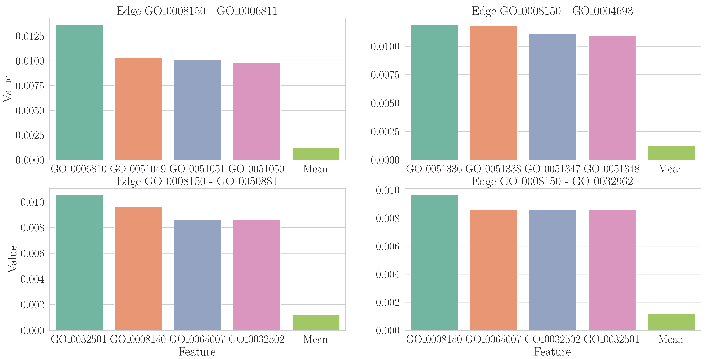

# Link Analysis meets Ontologies: Are Embeddings the Answer?
This repository contains code that is used and presented in the paper **_Link Analysis meets Ontologies: Are 
Embeddings the Answer?_**, that can be found [here](https://arxiv.org/abs/2111.11710).

## Getting started

To use our code, first download it to your computer. This can be done by running the following command.
```
git clone git@github.com:smeznar/anomaly-detection-in-ontologies.git
```
After this you need to setup the environment. We suggest using python 3.6, as some dependencies are supported only upto
this version. If you're using conda, you can use the command
```
conda env create -f env.yml
```
from the root folder, otherwise the command 
```
pip install -r requirements.txt
```
can be used.

Your environment should now be ready, follow instructions in the sections below for more information how to transform 
ontologies into a graph (and format used throughout all other code), run link prediction, create recommendations for
missing and redundant edges, and create explanations for the created recommendations.

## Ontology to graph transformation

To use the code in the other sections, we first need to transform the ontology into a graph. Our code can read two
different formats (JSON and txt). The JSON format is structured as:
```
{"graphs": {
    "nodes":[{
    	"id": "string" ,
        "type": "string",
        "lbl": "string"}],
    "edges":[{
        "sub": "string",
        "pred": "string",
        "obj": "string"}]}}
```
where nodes is a list of nodes with id "id", type "type", and label "lbl", and edges are triplets where "sub" is the 
subject, "pred" predicate (relation), and "obj" object.

The txt file is formated as:
```
subject\t object\t predicate 
```

Some example ontologies (the ones used in the paper) can be found inside the data directory together with their
[origin and sources](data/README.md). If you want to test our approach on your own ontology, you can transform an owl file into a JSON file by TBA.

A knowledge graph can also be used with this approach if transformed into a suitable format.

## Link prediction

An overview of the link prediction methodology is presented in the image below.



Using this benchmark you should get the following results:

TBA: slika z rezultati

link prediction benchmark (5-fold cross-validation) can be ran by using the command from the src directory:
```
python link_prediction.py --method {method} --dataset {dataset} --format {format} --out {out}
```
where _{method}_ is the baseline used, _{dataset}_ is the directory of the dataset, _{format}_ is the format type of the 
dataset, and _{out}_ is the directory where the results will be stored.

By default the following settings can be used:
- **_{method}_**: _Adamic_, _Jaccard_, _Preferential_, _SNoRe_, _node2vec_, _Spectral_, _TransE_, 
_RotatE_, _GAT_, _GIN_, _GCN_, _GAE_, _metapath2vec_
- **_{dataset}_**: ../data/{d}.json, where {d} is one of _anatomy_, _emotions_, _marine_, _scto_, _ehdaa_, _foodon_, _go_,
or ../data/LKN.txt
- **_{format}_**: _json_ or _txt_, depending on the **_{dataset}_** file

You can also add your own method by adding it into the _src/models.py_ file. An example of this can be found in the 
_examples/new_method.py_ file. after doing this you must import the created class inside the _src/link_prediction.py_ 
file as
```
from models import MyMethod
```
and add it to the methods dictionary in the line 15 of the _src/link_prediction.py_ file (in the same way as 
the other methods are).

## Recommendations for missing and redundant edges

The overview of our approach for creating recommendations of missing and redundant edges in show in the figure below.


TBA

## Temporal approach for evaluating recommendations

The overview of our approach for evaluating recommendation using multiple versions of an ontology can be seen in the image below

TBA

## Explanation of recommendations
TBA

### Global explanation
An example of a global explanation can be seen in the image below


TBA
### Local explanation
An example of a local explanation can be seen in the image below


TBA

## Contributing

To contribute, simply open an issue or a pull request!

## Authors

Paper and the corresponding code were created by Sebastian Mežnar, Matej Bevec, Nada Lavrač, and Blaž Škrlj. 

## License

See LICENSE.md for more details.

## Citation

Please cite as:

```
@misc{meznar2021link,
      title={Link Analysis meets Ontologies: Are Embeddings the Answer?}, 
      author={Sebastian Mežnar and Matej Bevec and Nada Lavrač and Blaž Škrlj},
      year={2021},
      eprint={2111.11710},
      archivePrefix={arXiv},
      primaryClass={cs.LG}
}
```